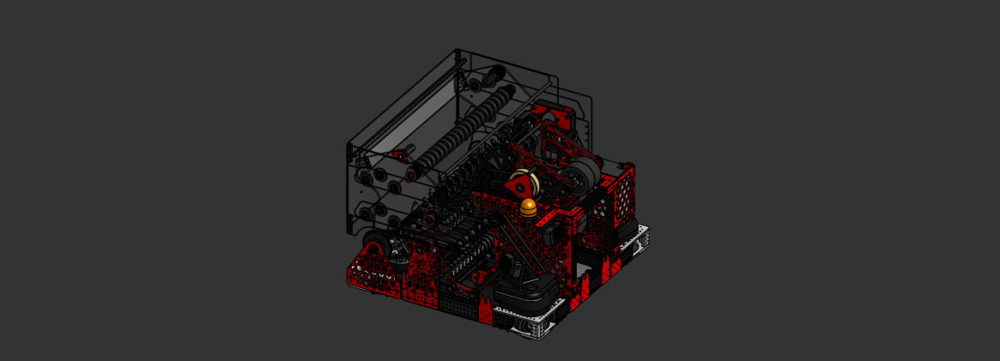

# Farsight Code Repository

Farsight is our 2026 FRC competition robot. It features a field-centric swerve drivetrain with vision-assisted odometry using three Limelights for AprilTag pose estimation. The shooter uses a velocity PID loop with a distance-based interpolation table to automatically adjust wheel speed based on the robot's live distance to the hub. The intake pivots down to collect game pieces off the floor and feeds them through a roller and feeder stage up to the shooter. Autonomous routines are built with PathPlanner.

## Subsystems

### Swerve / Drivetrain
- Field-centric swerve drive using CTRE Phoenix 6
- Pose estimated via `SwerveDrivePoseEstimator` fused with vision measurements
- Auto-aligns to face the hub using a yaw PID controller
- PathPlanner integration for autonomous path following
- Slow mode toggle that scales all driver inputs to 25%

### Shooter
- Two TalonFX motors in a leader/follower configuration
- Velocity PID loop on the leader, follower runs opposed
- Distance-to-velocity lookup table with linear interpolation between known setpoints
- Distance pulled live from swerve odometry

### Intake
- Pivot driven by two TalonFX motors (leader/follower) using position PID
- Releases to coast once fully deployed so the intake can rest on the floor naturally
- Separate roller motor handles game piece ingestion via voltage control
- Reverse direction supported for ejecting game pieces

### Feeder
- Single TalonFX feeding game pieces from the intake stage up to the shooter
- Voltage controlled with forward and reverse directions
- Run in parallel with rollers during the shoot sequence

### Rollers
- Single TalonFX indexing game pieces between the intake and feeder
- Voltage controlled with forward and reverse directions

### Vision / Limelights
- Three Limelights used for AprilTag-based localization
  - **Front:** faces the hub, primary reference for shot distance
  - **Left:** side coverage for field localization
  - **Right:** side coverage for field localization
- Pose estimates fused into odometry with conservative standard deviations
- Single-tag readings rejected if ambiguity exceeds 0.7 or tag is more than 3 meters away
